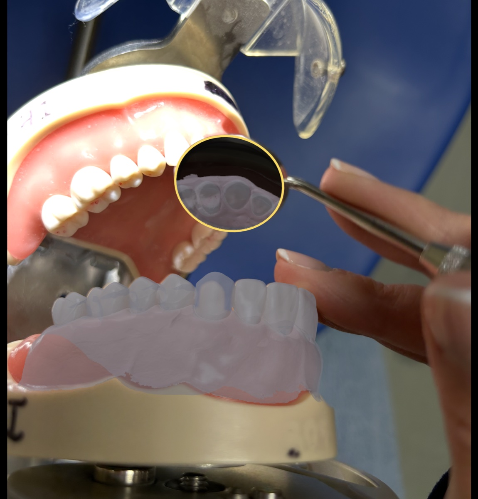

# Le Calque de Taille

> *Comparer, améliorer.*

**Live demo:** <https://ericdemers.github.io/le-calque-de-taille/>

An open-source web app for dental students learning tooth preparation.
Snap a phone photo of your work, overlay a 3D Reference on top of it,
and drag the 3D Reference into alignment with touch gestures — a way
to see in 2D and think in 3D, without needing a scanner.

## What it does

- **Photo + 3D reference overlay.** One-finger drag rotates, two-finger
  drag pans, pinch pushes along the view ray (mouse: click-drag,
  right-click-drag, scroll). Per-sample initial pose is loaded from
  `samples/manifest.json`.
- **Virtual mirror disc (Miroir).** A 3D reflective disc you position
  to match the real dental mirror in the photo — for practising how a
  mirror view corresponds to a particular anatomical surface.
- **Composite zoom (Vue).** Pinch / scroll-wheel zooms the whole image
  (photo + 3D + mirror together) for detail work, with the camera and
  poses untouched.
- **Focal length adjustment.** Auto-read from EXIF
  (`FocalLengthIn35mmFilm`), tunable via a slider in millimetres.
  Compensated so the 3D Reference doesn't visibly grow or shrink — only
  perspective foreshortening changes.
- **Contextual opacity slider** for the reference (in Référence mode) or
  the mirror (in Miroir mode).
- **Undo** for every gesture (drag, pinch, wheel, slider release, mode
  changes that toggle state). No redo in V1.
- **PWA.** Installable on iPhone via Safari → Share → *Sur l'écran
  d'accueil*; works offline after the first online load.
- **French + English UI** — French default, English toggle on the
  welcome screen.

## Contributing

This codebase is designed to be argued with.

- **`AGENTS.md`** — entry point for any contributor or AI assistant
  (Claude Code, Cursor, GitHub Copilot, …). Architecture invariants,
  file map, conventions, console helpers. **Read this first.**
- **`DESIGN_NOTES.md`** — every non-obvious decision and the
  reasoning, with each entry flagged as "you can argue with this."
- **`CONTRIBUTING.md`** — short PR + commit conventions.

When you change code, update the doc in the same PR.

## License

MIT — see [`LICENSE`](./LICENSE).
